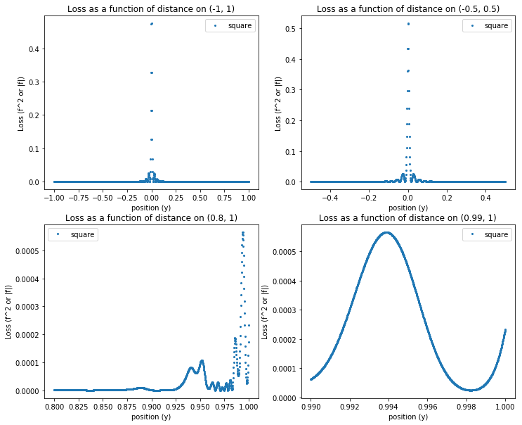
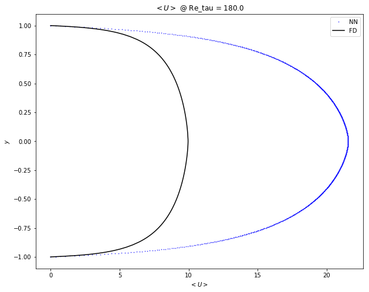
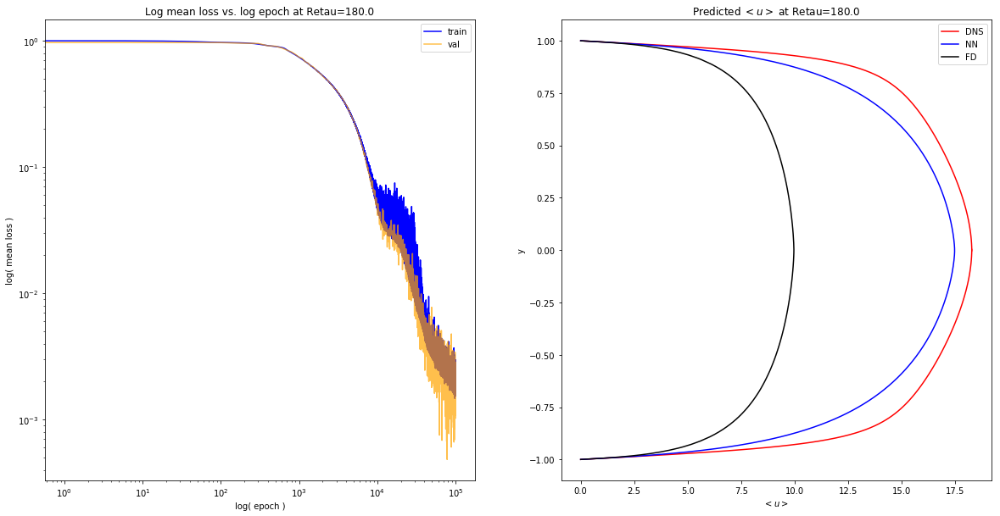
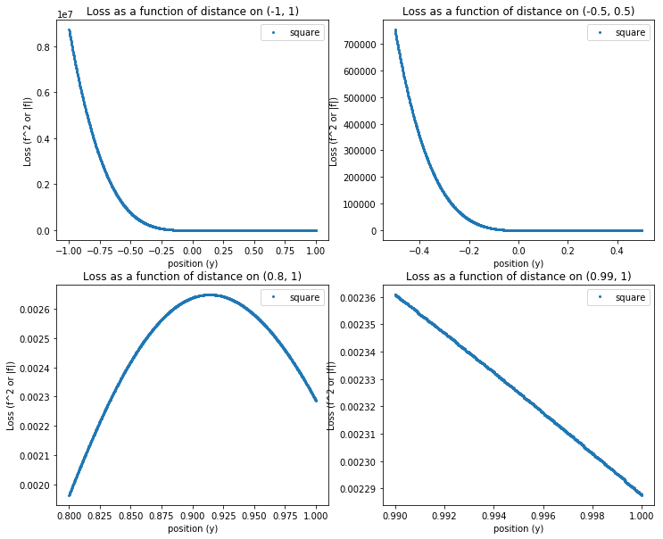

## Contents
{:.no_toc}
*  
{: toc}


```python
import pde_nn.channel_flow as chan
import utils
import numpy as np
import os
import matplotlib.pyplot as plt
import pandas as pd
```


## Baseline


```python
# def load_cv_kappas(top_dir):
top_dir='data/cv_kappa/'
preds=[]
hypers=[]
for d in os.listdir(top_dir):
    hyp=np.load(top_dir+d+'/hypers.npy').item()
    pred=np.load(top_dir+d+'/preds.npy')
    hypers.append(hyp)
    preds.append(pred)
    print('KAPPA = {}'.format(hyp['k']))
#     utils.expose_results('cv_kappa/{}'.format(d))

```


    KAPPA = 0.5
    KAPPA = 0.3
    KAPPA = 0.1
    KAPPA = 0.2
    KAPPA = 0.41


```python
import pandas as pd
y = np.linspace(-1,1,1000)
fig,  ax = plt.subplots(1,1, figsize=(15,10))
dns = pd.read_csv('data/LM_Channel_Retau180.txt', delimiter=' ')
utils.plot_dns(ax, dns, hypers[0], color='black')
for i,p in enumerate(preds):
    ax.plot(p, y, '--', label='$\kappa$={}'.format(hypers[i]['k']))
plt.title('Velocity profiles for different mixing lengths')
plt.ylabel('$y$')
plt.xlabel('$<u>$')
plt.legend();
```


## Baseline v2


```python
# def load_cv_kappas(top_dir):
top_dir='data/cv_kappa_retau180/'
preds=[]
hypers=[]
for d in os.listdir(top_dir):
    hyp=np.load(top_dir+d+'/hypers.npy').item()
    pred=np.load(top_dir+d+'/preds.npy')
    hypers.append(hyp)
    preds.append(pred)
    print('KAPPA = {}'.format(hyp['k']))
#     utils.expose_results('cv_kappa_retau180/{}'.format(d))
```


    KAPPA = 0.12
    KAPPA = 0.19
    KAPPA = 0.18
    KAPPA = 0.15
    KAPPA = 0.17


```python
import pandas as pd
y = np.linspace(-1,1,1000)
fig,  ax = plt.subplots(1,1, figsize=(15,10))
dns = pd.read_csv('data/LM_Channel_Retau180.txt', delimiter=' ')
utils.plot_dns(ax, dns, hypers[0], color='black')
for i,p in enumerate(preds):
    ax.plot(p, y, '--', label='$\kappa$={}'.format(hypers[i]['k']))
plt.title('Velocity profiles for different mixing lengths (Retau = 180)')
plt.ylabel('$y$')
plt.xlabel('$<u>$')
plt.legend();
```


## $Re_{tau} = 1000$


```python
# def load_cv_kappas(top_dir):
top_dir='data/cv_kappa_retau1k/'
preds1k=[]
hypers1k=[]
for d in os.listdir(top_dir):
    hyp=np.load(top_dir+d+'/hypers.npy').item()
    pred=np.load(top_dir+d+'/preds.npy')
    hypers1k.append(hyp)
    preds1k.append(pred)
    print('KAPPA = {}'.format(hyp['k']))
#     utils.expose_results('cv_kappa_retau1k/{}'.format(d), dns_file='data/LM_Channel_Retau1000.txt',
#                          numerical_file='data/mixlen_numerical_u1000.npy')

```


    KAPPA = 0.19
    KAPPA = 0.12
    KAPPA = 0.15
    KAPPA = 0.18
    KAPPA = 0.17


```python
import pandas as pd
y = np.linspace(-1,1,1000)
fig,  ax = plt.subplots(1,1, figsize=(15,10))
dns = pd.read_csv('data/LM_Channel_Retau1000.txt', delimiter=' ')
utils.plot_dns(ax, dns, hypers1k[0], color='black')
for i,p in enumerate(preds1k):
    ax.plot(p, y, '--', label='$\kappa$={}'.format(hypers1k[i]['k']))
plt.title('Velocity profiles for different mixing lengths (Retau = 1000)')
plt.ylabel('$y$')
plt.xlabel('$<u>$')
plt.legend();
```


## 2x Units ($Re_{tau} = 180$)


```python
# def load_cv_kappas(top_dir):
top_dir='data/cvkappa_2by80units/'
preds80unit=[]
hypers80unit=[]
for d in os.listdir(top_dir):
    hyp=np.load(top_dir+d+'/hypers.npy').item()
    pred=np.load(top_dir+d+'/preds.npy')
    hypers80unit.append(hyp)
    preds80unit.append(pred)
    print('KAPPA = {}'.format(hyp['k']))
    utils.expose_results('cvkappa_2by80units/{}'.format(d), dns_file='data/LM_Channel_Retau180.txt',
                         numerical_file='data/mixlen_numerical_u180.npy')

```


    KAPPA = 0.13


    KAPPA = 0.12





    KAPPA = 0.18


    KAPPA = 0.15


    KAPPA = 0.14





    KAPPA = 0.16


    KAPPA = 0.17


    KAPPA = 0.19





```python
import pandas as pd
y = np.linspace(-1,1,1000)
fig,  ax = plt.subplots(1,1, figsize=(15,10))
dns = pd.read_csv('data/LM_Channel_Retau180.txt', delimiter=' ')
utils.plot_dns(ax, dns, hypers80unit[0], color='black')
for i,p in enumerate(preds80unit):
    ax.plot(p, y, '--', label='$\kappa$={}'.format(hypers80unit[i]['k']))
plt.title('Velocity profiles for different mixing lengths (Retau = 180) | Network with Double Num. Units')
plt.ylabel('$y$')
plt.xlabel('$<u>$')
plt.legend();
```


```python
fig,  ax = plt.subplots(1,1, figsize=(15,10))
dns = pd.read_csv('data/LM_Channel_Retau180.txt', delimiter=' ')
utils.plot_dns(ax, dns, hypers80unit[0], color='black')
ax.plot(preds[2], y, '--', label='k=0.18, 80 units')
ax.plot(preds[-1], y, '--', label='k=0.17, 80 units')
ax.plot(preds80unit[2], y, '-', label='k=0.18, 160 units')
ax.plot(preds80unit[-2], y, '-', label='k=0.17, 160 units')
ax.set_title('Comparison of velocity profiles with different kappa and number of units')
ax.set_xlabel('< u >')
ax.set_ylabel('y')
ax.legend();
```


## 2x Points ($Re_{tau} = 180$)


```python
# def load_cv_kappas(top_dir):
top_dir='data/cvkappa_2kpts/'
preds2kpts=[]
hypers2kpts=[]
for d in os.listdir(top_dir):
    hyp=np.load(top_dir+d+'/hypers.npy').item()
    pred=np.load(top_dir+d+'/preds.npy')
    hypers2kpts.append(hyp)
    preds2kpts.append(pred)
    print('KAPPA = {}'.format(hyp['k']))
    utils.expose_results('cvkappa_2kpts/{}'.format(d), dns_file='data/LM_Channel_Retau180.txt',
                         numerical_file='data/mixlen_numerical_u180.npy')

```


    KAPPA = 0.17


    KAPPA = 0.18


    KAPPA = 0.15


    KAPPA = 0.12


    KAPPA = 0.13


    KAPPA = 0.16


    KAPPA = 0.19


    KAPPA = 0.14


```python
import pandas as pd
y = np.linspace(-1,1,1000)
fig,  ax = plt.subplots(1,1, figsize=(15,10))
dns = pd.read_csv('data/LM_Channel_Retau180.txt', delimiter=' ')
utils.plot_dns(ax, dns, hypers2kpts[0], color='black')
for i,p in enumerate(preds2kpts):
    ax.plot(p, y, '--', label='$\kappa$={}'.format(hypers2kpts[i]['k']))
plt.title('Velocity profiles for different mixing lengths (Retau = 180) | Network with 2K Points')
plt.ylabel('$y$')
plt.xlabel('$<u>$')
plt.legend();
```


```python
fig,  ax = plt.subplots(1,1, figsize=(15,10))
dns = pd.read_csv('data/LM_Channel_Retau180.txt', delimiter=' ')
utils.plot_dns(ax, dns, hypers2kpts[0], color='black')
ax.plot(preds[2], y, '--', label='k=0.18, 1k pts')
ax.plot(preds[-1], y, '--', label='k=0.17, 1k pts')
ax.plot(preds2kpts[1], y, '-', label='k=0.18, 2k pts')
ax.plot(preds2kpts[0], y, '-', label='k=0.17, 2k pts')
ax.set_title('Comparison of velocity profiles with different kappa and grid size')
ax.set_xlabel('< u >')
ax.set_ylabel('y')
ax.legend();
```


```python
## Kappa = 0.41, but use (y + 1) / 2 transform
utils.expose_results('1552060874.828267')
```


```python
## Kappa = 0.41, use y=y
utils.expose_results('1552284676.446561')
```


```python
utils.expose_results('1552285488.3520331')
```


```python
utils.expose_results('1552285971.611496')
```





```python
utils.expose_results('1552286320.534849')
```


```python
# def load_cv_kappas(top_dir):
top_dir='data/cvkappa_halfk/'
preds=[]
hypers=[]
for d in os.listdir(top_dir):
    hyp=np.load(top_dir+d+'/hypers.npy').item()
    pred=np.load(top_dir+d+'/preds.npy')
    hypers.append(hyp)
    preds.append(pred)
    print('KAPPA = {}'.format(hyp['k']))
#     utils.expose_results('cv_kappa/{}'.format(d))
```


    KAPPA = 0.42
    KAPPA = 0.41
    KAPPA = 0.38
    KAPPA = 0.39
    KAPPA = 0.4


## Half $\kappa$


```python
y = np.linspace(-1,1,1000)
fig, ax = plt.subplots(1,1,figsize=(15,10))
dns = pd.read_csv('data/LM_Channel_Retau180.txt', delimiter=' ')
utils.plot_dns(ax, dns, hypers[0], color='black')
for i,p in enumerate(preds):
    plt.plot(p, y, label='k={}'.format(hypers[i]['k']))
plt.legend();
```


