## Contents
{:.no_toc}
*  
{: toc}


```python
import numpy as np
import matplotlib.pyplot as plt
from IPython.display import clear_output
```


# Baby Equation

# $$ \frac{dx}{dt} = \lambda x$$

# Setup

### Generator takes input $t$ and proposes solutions: $x(t)$


```python
from pde_nn.utils import draw_neural_net
fig, ax = plt.subplots(1,1,figsize=(10,8))
draw_neural_net(ax, .1, .9, .1, .9, [1,20, 20, 20,1])
ax.set_title('Generator Architecture', fontsize=15);
```


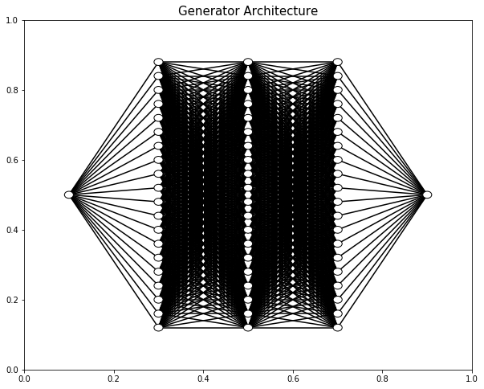


### Autograd used to calculate derivative $\frac{dx}{dt}$.

### Discriminator classifies real for $\lambda x$ and fake for $\frac{dx}{dt}$. Generator tries to fool discriminator to predict real on fake.


```python
from pde_nn.utils import draw_neural_net
fig, ax = plt.subplots(1,1,figsize=(10,8))
draw_neural_net(ax, .1, .9, .1, .9, [1, 10, 10,1])
ax.set_title('Discriminator Architecture', fontsize=15);
```


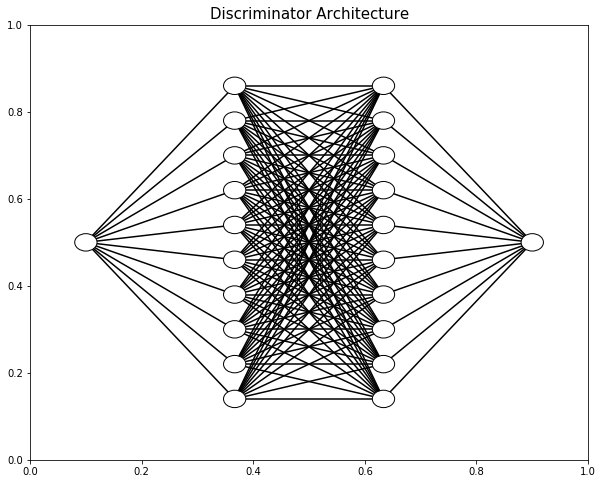


### They play this game until, hopefully, the generator produces solution x(t) indistinguishable from true.

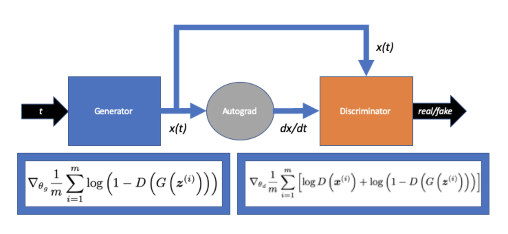

## Analytic Solutionn


```python
L = -1
analytic = lambda t: np.exp(L*t)
```


```python
t = np.linspace(0,10,100)
plt.figure(figsize=(10,7))
plt.xlabel('$t$', fontsize=20)
plt.ylabel('$x$', fontsize=20)
plt.plot(t, analytic(t), 'o', alpha=0.5, label='analytic')
plt.title('Analytic solution for L=-1 (n=100)', fontsize=20);
```


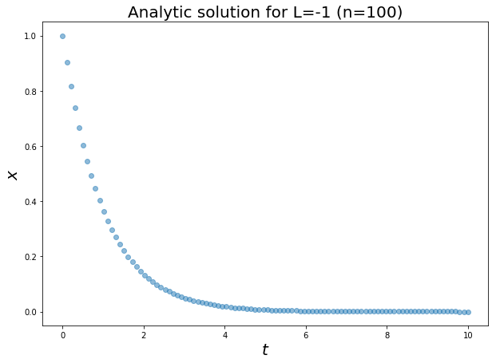


## GAN


```python
import torch
import torch.nn as nn
from torch import tensor, autograd
from collections import OrderedDict
torch.manual_seed(1337)
```


    <torch._C.Generator at 0x113560d90>


```python
from pde_nn.gan import Generator, Discriminator, train_GAN, train_Lagaris
from pde_nn.gan import plot_loss, plot_preds, plot_losses_and_preds
```


## GAN Training


```python
%%time
G,D,G_loss,D_loss = train_GAN(500,
                              g_hidden_units=20,
                              g_hidden_layers=3,
                              d_hidden_units=10,
                              d_hidden_layers=2,
                              logging=False,
                              G_iters=9,
                              D_iters=1,
                              n=100)
plot_losses_and_preds(G_loss, D_loss, G, t, analytic) # (with fix of freezing parameters!)
```


    CPU times: user 23.3 s, sys: 152 ms, total: 23.4 s
    Wall time: 23.5 s


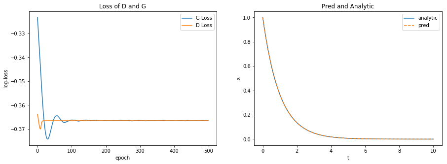


```python
%%time
G,D,G_loss,D_loss = train_GAN(500,
                              g_hidden_units=20,
                              g_hidden_layers=3,
                              d_hidden_units=10,
                              d_hidden_layers=2,
                              logging=False,
                              G_iters=9,
                              D_iters=1,
                              n=100)
plot_losses_and_preds(G_loss, D_loss, G, t, analytic) # no freezing!
```


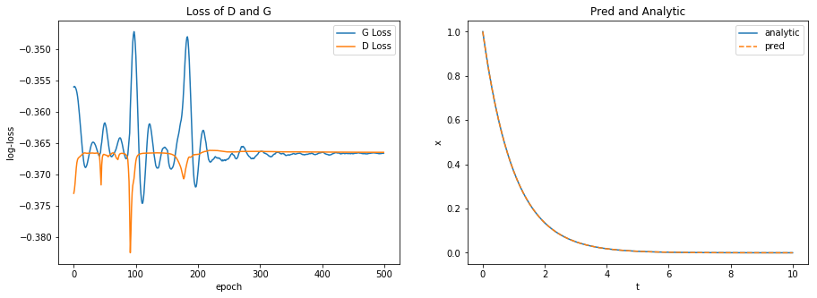


    CPU times: user 21.5 s, sys: 114 ms, total: 21.6 s
    Wall time: 21.6 s


## Lagaris Training


```python
%%time
F,F_loss = train_Lagaris(500,
                         g_hidden_units=20,
                         g_hidden_layers=3,
                         G_iters=10,
                         n=100)
plot_losses_and_preds(F_loss, F_loss, F, t, analytic)
```


    CPU times: user 22.8 s, sys: 135 ms, total: 22.9 s
    Wall time: 22.9 s


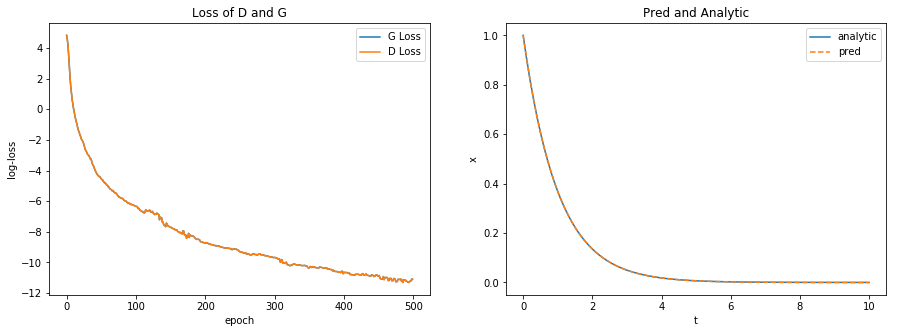


## Compare MSE (pred vs. actual)


```python
t_torch = tensor(t, dtype=torch.float, requires_grad=True).reshape(-1,1)
gan_pred = G.predict(t_torch)
lag_pred = F.predict(t_torch)
```


```python
actual = tensor(analytic(t), dtype=torch.float).reshape(-1,1)
```


```python
mse = nn.MSELoss()
gan_mse = mse(gan_pred, actual)
lag_mse = mse(lag_pred, actual)
```


```python
print('GAN MSE: {}'.format(gan_mse))
print('Lagaris MSE: {}'.format(lag_mse))
```


    GAN MSE: 2.847582196083276e-12
    Lagaris MSE: 3.588611008353837e-08


## Compare MSE (many trials)


```python
n = 10
ep = 500
gan_mses = []
lag_mses = []
lags = []
gans = []
F_losses = []
G_losses = []
D_losses = []
for i in range(n):

    G,D,G_loss,D_loss = train_GAN(ep,
                              g_hidden_units=20,
                              g_hidden_layers=3,
                              d_hidden_units=10,
                              d_hidden_layers=2,
                              logging=False,
                              G_iters=9,
                              D_iters=1,
                              n=100)

    F,F_loss = train_Lagaris(ep,
                         g_hidden_units=20,
                         g_hidden_layers=3,
                         G_iters=10,
                         n=100)

    gans.append(G)
    lags.append(F)

    gan_mses.append(mse(G.predict(t_torch), actual).item())
    lag_mses.append(mse(F.predict(t_torch), actual).item())

    G_losses.append(G_loss)
    D_losses.append(D_loss)
    F_losses.append(F_loss)
```


```python
for i in range(n):
    spaces = ' '*(25-len(str(gan_mses[i])))
    print("GAN: {} {} LAG: {}".format(gan_mses[i], spaces, lag_mses[i]))
```


    GAN: 2.422474113666917e-12      LAG: 2.4981332558127178e-08
    GAN: 5.922702971372087e-15      LAG: 1.7654894435281676e-08
    GAN: 8.48264438291918e-13       LAG: 2.5764915534409738e-08
    GAN: 2.968019485473633          LAG: 5.872946218232755e-08
    GAN: 6.313779252024865e-13      LAG: 6.642136174406232e-09
    GAN: 6.263148888407954e-10      LAG: 1.047880804350143e-08
    GAN: 3.9885811667361715e-12     LAG: 3.5024996236643346e-08
    GAN: 6.675635813735425e-05      LAG: 3.094884704069045e-08
    GAN: 1.535515726342699e-14      LAG: 3.003405968371453e-09
    GAN: 7.890315191581149e-16      LAG: 1.9871622569667124e-08


```python
fig, ax = plt.subplots(1,1)
ax.hist(np.log(gan_mses), bins=10, label='GAN')
ax.hist(np.log(lag_mses), bins=10, label='Lagaris')
ax.legend()
ax.set_xlabel('log MSE')
ax.set_ylabel('Frequency')
ax.set_title('MSE Comparison of GAN vs Lagaris');
```


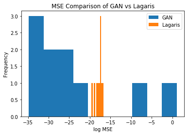


## Worst GAN


```python
mess = np.argmax(gan_mses)
plot_losses_and_preds(G_losses[mess], D_losses[mess], gans[mess], t, analytic)
```


    (<matplotlib.axes._subplots.AxesSubplot at 0x11771cda0>,
     <matplotlib.axes._subplots.AxesSubplot at 0x1176c4128>)


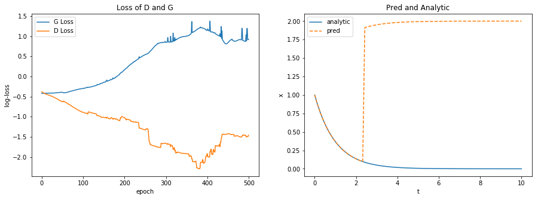


## Best GAN


```python
best = np.argmin(gan_mses)
plot_losses_and_preds(G_losses[best], D_losses[best], gans[best], t, analytic)
```


    (<matplotlib.axes._subplots.AxesSubplot at 0x105ed95c0>,
     <matplotlib.axes._subplots.AxesSubplot at 0x105f03278>)


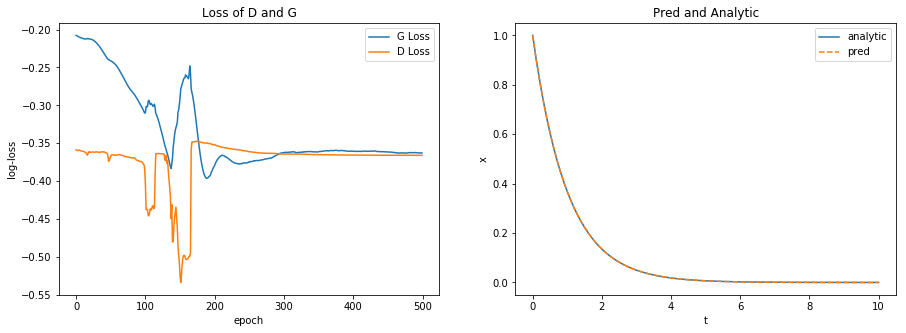


## All GAN Losses


```python
join_losses = list(zip(G_losses, D_losses, gan_mses))
join_losses = sorted(join_losses, key=lambda x: x[2])
```


```python
fig, ax = plt.subplots(3,4,figsize=(15,8))
fig.tight_layout(pad=1.5)
ax = ax.ravel()
for i, a_ in enumerate(ax):
    if i>len(G_losses)-1:
        fig.delaxes(a_)
    else:
        plot_loss(join_losses[i][0], join_losses[i][1], a_)
        a_.set_title("MSE={}".format(join_losses[i][2]))
        a_.set_xlabel('')
        a_.set_ylabel('')
```


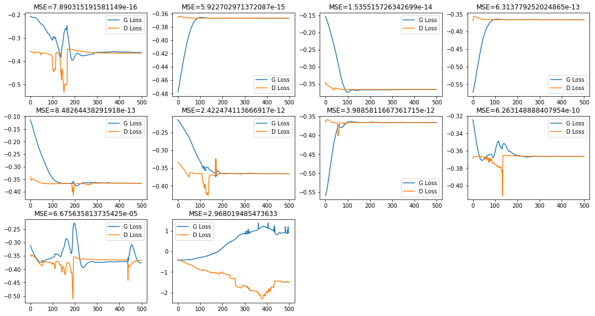


## Extrapolate??


```python
fig, ax = plt.subplots(1,1, figsize=(10,6))
t_ext = np.linspace(0,100,1000)
plot_preds(gans[best], t_ext, analytic, ax)
```


    <matplotlib.axes._subplots.AxesSubplot at 0x11733eeb8>


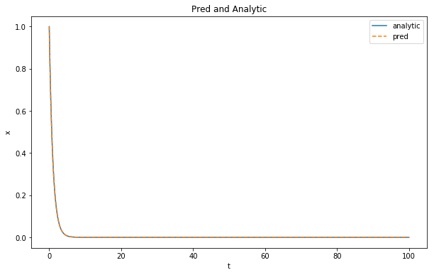


```python
fig, ax = plt.subplots(1,1, figsize=(10,6))
t_ext = np.linspace(0,100,1000)
plot_preds(lags[best], t_ext, analytic, ax)
```


    <matplotlib.axes._subplots.AxesSubplot at 0x117795cc0>


Same as GAN in this case.

# New Equation: Simple Harmonic Oscillator

# $$ m \frac{d^2 x}{d t^2} = -kx $$

**Set up:**

## $ x = -\frac{m}{k} \frac{d^2 x}{d t^2} = -\frac{d^2 x}{d t^2} $

- Real: $x(t)$

- Fake: $-\frac{m}{k} \frac{d^2 x}{d t^2}$

- Constants: $m=1, k=1 \implies \omega = 1$

- Initial condition: $x(0) = 0, \frac{dx}{dt}(0)=-.5$

**Analytic Solution:**

$ x(t) = A \text{cos}(\omega t + \phi), \text{ where } \omega = \sqrt{\frac{k}{m}}$

or

$ x(t) = x_0 \cos{\omega t} + \frac{v_0}{\omega} \sin(\omega t) $


```python
analytic_oscillator = lambda t: 0*np.cos(t) + .5*np.sin(t)
t = np.linspace(0,2*np.pi,100)
plt.plot(t, analytic_oscillator(t), '-o', alpha=0.3)
plt.title('Solution of Harmonic Oscillator')
plt.xlabel('time (t)')
plt.ylabel('position (x)');
```


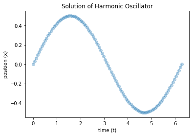


** Note: ** it lies within the same range as `tanh` which is helpful.


```python
from pde_nn.gan import train_GAN_SHO
import numpy as np
import torch.nn as nn
import torch
```


## Unsupervised

### Demo


```python
# %%time
# torch.manual_seed(42)
# G,D,G_loss,D_loss = train_GAN_SHO(2000,
#                               g_hidden_units=20,
#                               g_hidden_layers=2,
#                               d_hidden_units=30,
#                               d_hidden_layers=2,
#                               d_lr=0.001,
#                               g_lr=0.001,
#                               t_low=0,
#                               t_high=2*np.pi,
#                               logging=False,
#                               G_iters=9,
#                               D_iters=1,
#                               n=100,
#                               x0=0.,
#                               dx_dt0=.5,
#                               realtime_plot=True,
#                               activation=nn.Tanh(),
#                               wgan=False,
#                               soft_labels=False,
#                               real_data=False)
```


- noise to x and derivative (independelty white nosie)
- two eqns (two generators?)

#### 15 Gen : 1 Disc | 20x2 Gen | 30x2 Disc


#### 9 Gen : 1 Disc | 20x2 Gen | 30x2 Disc


## System of ODE

$$\begin{equation}
\frac{dx}{dt} = u
\end{equation}$$

$$\begin{equation}
\frac{du}{dt} = -x
\end{equation}$$

### Demo


```python
%%time
torch.manual_seed(42)
G,D1,D2,G_loss,D_loss = train_GAN_SHO(5000,
                              g_hidden_units=40,
                              g_hidden_layers=4,
                              d_hidden_units=20,
                              d_hidden_layers=2,
                              d_lr=0.001,
                              g_lr=0.001,
                              t_low=0,
                              t_high=2*np.pi,
                              logging=False,
                              G_iters=15,
                              D_iters=1,
                              n=100,
                              x0=0.,
                              dx_dt0=.5,
                              realtime_plot=False,
                              activation=nn.Tanh(),
                              wgan=False,
                              soft_labels=False,
                              real_data=False,
                              systemOfODE=True)
```


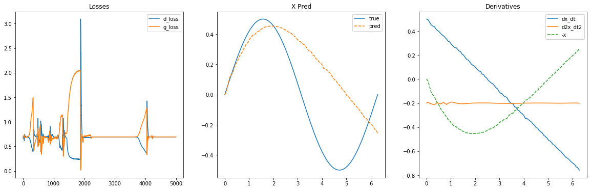


    --------------------------------------------------------------------------

    NameError                                Traceback (most recent call last)

    <timed exec> in <module>()


    ~/Documents/harvard/research/pde_nn/pde_nn/gan.py in train_GAN_SHO(num_epochs, g_hidden_units, d_hidden_units, g_hidden_layers, d_hidden_layers, d_lr, g_lr, t_low, t_high, n, real_label, fake_label, logging, G_iters, D_iters, m, k, clip, loss_diff, max_while, gp_hyper, x0, dx_dt0, activation, realtime_plot, wgan, soft_labels, real_data, gradient_penalty, savefig, fname, systemOfODE)
        683         return G, D, G_losses, D_losses
        684     else:
    --> 685         return G, D1, D2, G_losses, D_losses
        686
        687 if __name__ == "__main__":


    NameError: name 'D1' is not defined


#### 20x4 Gen | 2x 40x2 Disc | 4G : 1D


### Using data


```python
# %%time
# G,D,G_loss,D_loss = train_GAN_SHO(5000,
#                               g_hidden_units=20,
#                               g_hidden_layers=2,
#                               d_hidden_units=30,
#                               d_hidden_layers=2,
#                               d_lr=0.001,
#                               g_lr=0.001,
#                               t_low=0,
#                               t_high=2*np.pi,
#                               logging=False,
#                               G_iters=9,
#                               D_iters=1,
#                               n=100,
#                               clip=.1,
#                               max_while=10,
#                               x0=0.,
#                               dx_dt0=.5,
#                               realtime_plot=True,
#                               activation=nn.Tanh(),
#                               wgan=False,
#                               soft_labels=False,
#                               real_data=True)
```


### WGAN


```python
# %%time
# ## do it with data on (0,5) maybe
# G,D,G_loss,D_loss = train_GAN_SHO(2000,
#                               g_hidden_units=20,
#                               g_hidden_layers=1,
#                               d_hidden_units=60,
#                               d_hidden_layers=1,
#                               d_lr=0.01,
#                               g_lr=0.01,
#                               t_low=0,
#                               t_high=1,
#                               logging=False,
#                               G_iters=1,
#                               D_iters=1,
#                               n=100,
#                               clip=.1,
#                               max_while=10,
#                               x0=0,
#                               dx_dt0=-.5,
#                               realtime_plot=True,
#                               activation=nn.Tanh(),
#                               wgan=True,
#                               soft_labels=False,
#                               real_data=True,
#                               gradient_penalty=True,
#                               gp_hyper=1)
```


#### Literally fit the function?


```python
g=Generator(n_hidden_units=40, n_hidden_layers=4, activation=nn.Tanh(), output_tan=False)
t_torch = torch.tensor(t, dtype=torch.float).reshape(-1,1)
mse = torch.nn.MSELoss()
torch_analytical = 1*torch.cos(t_torch) + -1*torch.sin(t_torch)
opti_ = torch.optim.Adam(g.parameters(), lr=0.001, betas=(0.9, 0.999))

for e in range(1000):
    pred=g(t_torch)
    loss=mse(pred, torch_analytical)

    opti_.zero_grad()
    loss.backward()
    opti_.step()

plt.plot(t, g(t_torch).detach().numpy(), label='nn')
plt.plot(t, analytic_oscillator(t), label='analytic')
plt.legend()
plt.grid();
```


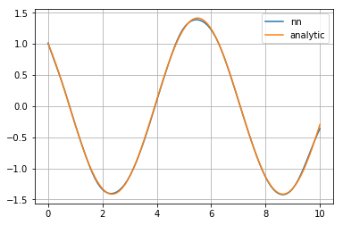


```python
class Swish(torch.nn.Module):
    """
    Swish activation function
    """
    def __init__(self, beta=1.0):
        super(Swish, self).__init__()
        self.beta = beta

    def forward(self, input):
        return input * torch.sigmoid(self.beta * input)

    def extra_repr(self):
        return 'beta={}'.format(self.beta)
```


```python
sigmoid = torch.nn.Sigmoid()
swish = lambda x: x * torch.sigmoid(1 * x)
x_in = torch.linspace(-5,5,100)
dx = x_in[1] - x_in[0]
swish_out = swish(x_in).detach().numpy()
x_in = x_in.detach().numpy()

plt.plot(x_in, swish_out, label='f')
swish_d1 = np.gradient(swish_out, x_in)
plt.plot(x_in, swish_d1, label='d1')
swish_d2 = np.gradient(swish_d1, x_in)
plt.plot(x_in, swish_d2, label='d2')
plt.legend()
plt.grid();
```


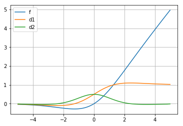


# Another Equation: Burgers' Equation

# $$ \frac{\partial u}{\partial t} + u \frac{\partial u}{\partial x} = \nu \frac{\partial^2 u}{\partial x^2} $$

**Set up:**

## $ u = \left( \nu \frac{\partial^2 u}{\partial x^2} - \frac{\partial u}{\partial t} \right) \left(\frac{\partial u}{\partial x}\right) ^{-1} $

- Real: $u(x,t)$

- Fake: $\left( \nu \frac{\partial^2 u}{\partial x^2} - \frac{\partial u}{\partial t} \right) \left(\frac{\partial u}{\partial x}\right) ^{-1}$

- Constant: $\nu = 1$

- Initial condition: $u(x,0)=f(x)$

**Numerical Solution:**
