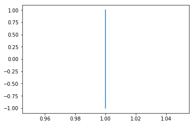
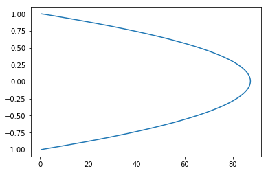
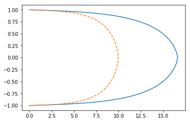
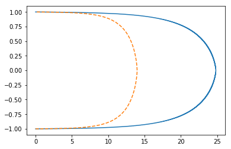
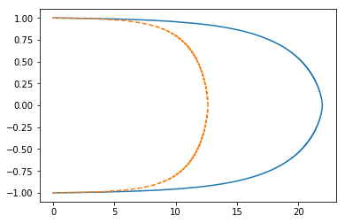
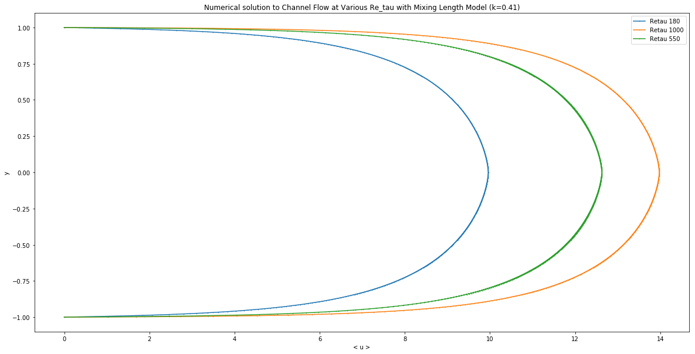

## Contents
{:.no_toc}
*  
{: toc}


```python
import pde_nn.channel_flow as chan
import matplotlib.pyplot as plt
import numpy as np
import utils
```


```python
# overall hypers
pde_nn = chan.Chanflow()
hypers=pde_nn.hypers
# hypers['nu']=0.001
retau=utils.calc_retau(hypers['delta'], hypers['dp_dx'], hypers['rho'], hypers['nu'])
print('Calculating at Retau={}'.format(retau))

# grid
delta=hypers['delta']
n = 1000
y = np.linspace(hypers['ymin'], hypers['ymax'], n)
delta_y = y[1] - y[0]
u0 = np.ones_like(y)
U_0, U_L = 0, 0
```


    Calculating at Retau=180.0000018


```python
hypers
```


    {'dp_dx': -1.0,
     'nu': 0.0055555555,
     'rho': 1.0,
     'k': 0.41,
     'num_units': 40,
     'num_layers': 2,
     'batch_size': 1000,
     'lr': 0.0001,
     'num_epochs': 1000,
     'ymin': -1,
     'ymax': 1,
     'weight_decay': 0,
     'delta': 1,
     'n': 1000,
     'in_dim': 1,
     'out_dim': 1,
     'retau': 180,
     'sampling': 'grid',
     'activation': 'tanh'}


```python
plt.plot(u0, y)
```


    [<matplotlib.lines.Line2D at 0x11107c0f0>]





```python
# just here for reference.
# reynolds_stress_fn = lambda y, du_dy: -1*((hypers['k']*(np.abs(y)-delta))**2)*np.abs(du_dy)*du_dy
# diffeq = lambda du2_dy2, dre_dy: hypers['nu']*du2_dy2 - dre_dy - (1/hypers['rho']) * hypers['dp_dx']
```


```python
def handle_boundary(u, i, n):
    # careful with boundaries. contains {i-2, i-1, i, i+1, i+2}
    # if we step on or beyond the boundary, just set to the boundary (check this assumption!)
    # returns u[i-2], u[i-1], u[i], u[i+1], u[i+2] while respecting boundary conditions

    if i==0: # far left
        return U_0, U_0, u[i], u[i+1], u[i+2]
    elif i==1: # second from left
        return U_0, u[i-1], u[i], u[i+1], u[i+2]
    elif i==n-2: # second from right
        return u[i-2], u[i-1], u[i], u[i+1], U_L
    elif i==n-1: # far right
        return u[i-2], u[i-1], u[i], U_L, U_L
    else: # no boundaries
        return u[i-2], u[i-1], u[i], u[i+1], u[i+2]

def Gf(u):
    n = u.shape[0]
    gvec = np.zeros(n)
    for i in range(n):

        uim2, uim1, ui, uip1, uip2 = handle_boundary(u, i, n)
        yim1, yip1 = y[i] - delta_y, y[i] + delta_y

        a = (hypers['nu'] / (delta_y ** 2)) * (uip1 - 2*ui + uim1)
        fplus = (uip2 - ui) / (2*delta_y)
        fminus = (ui - uim2) / (2*delta_y)
        b = (1 / (2 * delta_y)) * ((hypers['k'] * np.abs(yip1 - delta)) ** 2) * np.abs(fplus) * fplus
        c = (-1 / (2 * delta_y)) * ((hypers['k'] * np.abs(yim1 - delta)) ** 2) * np.abs(fminus) * fminus
        d = (-1 / hypers['rho']) * hypers['dp_dx']

        gvec[i] = a + b + c + d

    return gvec

def dGi_ui(u, i, eps=1e-8):
    n = u.shape[0]
    uim2, uim1, ui, uip1, uip2 = handle_boundary(u, i, n)
    yim1, yip1 = y[i] - delta_y, y[i] + delta_y

    a = -2*hypers['nu'] / (delta_y**2)
    b = (hypers['k']**2) / (2*delta_y)

    fplus = ((uip2 - ui)/(2*delta_y)) + eps
    fminus = ((ui - uim2)/(2*delta_y)) + eps

    c1 = (np.abs(yip1-delta)**2)
    c2 = (fplus**2) * (-1/(2*delta_y)) / np.abs(fplus)
    c3 = np.abs(fplus) * (-1/(2*delta_y))
    c = c1*(c2+c3)

    d1 = -(np.abs(yim1-delta)**2)
    d2 = (fminus**2) * (1/(2*delta_y)) / np.abs(fminus)
    d3 = np.abs(fminus) * (1/(2*delta_y))
    d = d1*(d2+d3)

    return a + b * (c + d)

def dGi_uim2(u, i, eps=1e-8):
    n = u.shape[0]
    uim2, uim1, ui, uip1, uip2 = handle_boundary(u, i, n)
    yim1, yip1 = y[i] - delta_y, y[i] + delta_y

    a = -((hypers['k'] * np.abs(yim1 - delta))**2) / (2*delta_y)
    fminus = ((ui - uim2) / (2*delta_y)) + eps
    b = (fminus**2) * (-1/(2*delta_y)) / np.abs(fminus)
    c = np.abs(fminus) * (-1/(2*delta_y))

    return a * (b + c)

def dGi_uip2(u, i, eps=1e-8):
    n = u.shape[0]
    uim2, uim1, ui, uip1, uip2 = handle_boundary(u, i, n)
    yim1, yip1 = y[i] - delta_y, y[i] + delta_y

    a = -((hypers['k'] * np.abs(yip1 - delta))**2) / (2*delta_y)
    fplus = ((uip2 - ui) / (2*delta_y)) + eps
    b = (fplus**2) * (1/(2*delta_y)) / np.abs(fplus)
    c = np.abs(fplus) * (1/(2*delta_y))

    return a * (b + c)

def jacobian(u, eps=1e-8):
    # returns an entire column of jacobian
    # careful with boundaries. contains {i-2, ..}
    n = u.shape[0]
    jac = np.zeros((n,n))
    for i in range(n):
        if i == 0:
            jac[i,i]=dGi_ui(u, i, eps)
            jac[i+1, i]=hypers['nu']/(delta_y**2)
            jac[i+2, i]=dGi_uip2(u, i, eps)
        elif i==1:
            jac[i-1, i] = hypers['nu']/(delta_y**2)
            jac[i, i] = dGi_ui(u, i, eps)
            jac[i+1, i] = hypers['nu']/(delta_y**2)
            jac[i+2, i] = dGi_uip2(u, i, eps)
        elif i==n-2:
            jac[i-2, i] = dGi_uim2(u, i, eps)
            jac[i-1, i] = hypers['nu']/(delta_y**2)
            jac[i, i] = dGi_ui(u, i, eps)
            jac[i+1, i] = hypers['nu']/(delta_y**2)
        elif i==n-1:
            jac[i-2, i] = dGi_uim2(u, i, eps)
            jac[i-1, i] = hypers['nu']/(delta_y**2)
            jac[i, i] = dGi_ui(u, i, eps)
        else:
            jac[i-2, i] = dGi_uim2(u, i, eps)
            jac[i-1, i] = hypers['nu']/(delta_y**2)
            jac[i, i] = dGi_ui(u, i, eps)
            jac[i+1, i] = hypers['nu']/(delta_y**2)
            jac[i+2, i] = dGi_uip2(u, i, eps)

    return jac

from tqdm import tqdm
def newton(u0, tol=1e-14, max_iter=int(1e6), eps=1e-8):
    u = u0
    for it in range(max_iter):
        G = Gf(u)
        jac = jacobian(u, eps=eps)
        delta_u = np.linalg.solve(jac, -G)
        u = u + delta_u
        max_du = np.max(delta_u)
        if it % 100 == 0:
            print('iter {}/{}: max delta_u = {}'.format(it, max_iter, max_du))
        if max_du < tol:
            break
    return u
```


## Scipy Root


```python
from scipy.optimize import root
```


```python
scipy_optimal_res = root(Gf, u0, jac=jacobian, method='lm')
```


```python
scipy_optimal_res.success
```


    True


```python
u_star = scipy_optimal_res.x
```


```python
plt.plot(u_star, y)
```


    [<matplotlib.lines.Line2D at 0x101ed4cc88>]





## Use Numpy gradient + Scipy Root


```python
ls = np.load('data/mixlen_numerical_u180.npy') #previous result
```


```python
reynolds_stress_fn = lambda y, du_dy: -1*((hypers['k']*(np.abs(y)-delta)/2)**2)*np.abs(du_dy)*du_dy
diffeq = lambda du2_dy2, dre_dy: hypers['nu']*du2_dy2 - dre_dy - (1/hypers['rho']) * hypers['dp_dx']
```


```python
def Gf_np(u):
    u[0],u[-1]=0,0
    du_dy = np.gradient(u, delta_y, edge_order=2)
    dre_dy = np.gradient(reynolds_stress_fn(y, du_dy), delta_y, edge_order=2)
    du2_dy2 = np.gradient(du_dy, delta_y, edge_order=2)
    return diffeq(du2_dy2, dre_dy)

scipy_opt = root(Gf_np, u0, method='lm')
```


```python
scipy_opt.success
```


    True


```python
plt.plot(scipy_opt.x, y)
plt.plot(ls, y, '--');
```





```python
new_kappa = scipy_opt.x
```


```python
# np.save('data/mixlen_numerical_u180_halfk.npy', new_kappa)
```


## retau 1k


```python
hypers['nu']=0.001
```


```python
scipy_opt1k = root(Gf_np, scipy_opt.x, method='lm')
```


```python
scipy_opt1k.success
```


    True


```python
prev1k = np.load('data/mixlen_numerical_u1000.npy')
```


```python
plt.plot(scipy_opt1k.x, y)
plt.plot(prev1k, y, '--');
```





```python
# np.save('data/mixlen_numerical_u1000_halfk.npy', scipy_opt1k.x)
```


## Retau 550


```python
hypers['nu']=0.001818181818
```


```python
scipy_opt550 = root(Gf_np, scipy_opt.x, method='lm')
```


```python
scipy_opt550.success
```


    True


```python
prev550 = np.load('data/mixlen_numerical_u550.npy')
```


```python
plt.plot(scipy_opt550.x, y)
plt.plot(prev550, y, '--');
```





```python
# np.save('data/mixlen_numerical_u550_halfk.npy', scipy_opt550.x)
```


```python
plt.figure(figsize=(20,10))
plt.plot(ls, y, '-o', label='Retau 180', markersize=0.5)
plt.plot(prev1k, y, '-o', label='Retau 1000', markersize=0.5)
plt.plot(prev550, y, '-o', label='Retau 550', markersize=0.5)
plt.legend()
plt.title('Numerical solution to Channel Flow at Various Re_tau with Mixing Length Model (k=0.41)')
plt.xlabel('< u >')
plt.ylabel('y')
```


    Text(0,0.5,'y')



