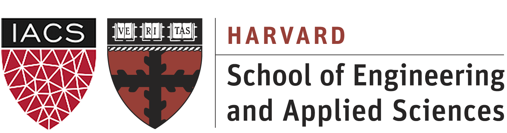
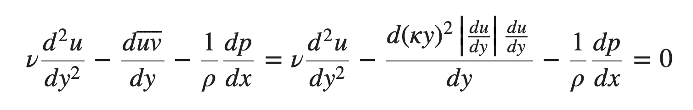
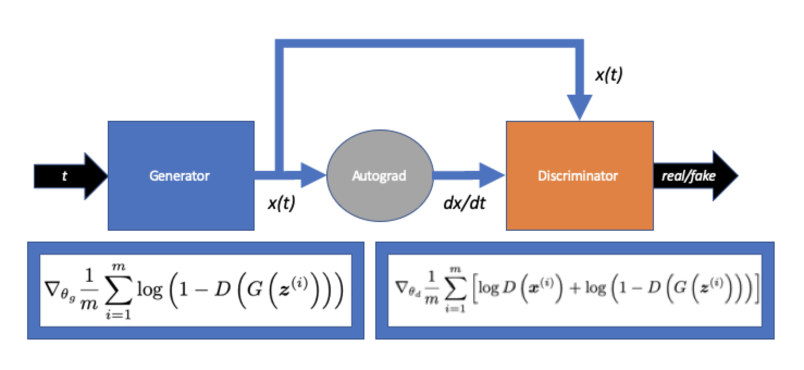

{:height="100px" width="400px"}

# Preamble

Over the last few months, I ([Dylan Randle](https://dylanrandle.github.io/)) have been working with [Pavlos Protopapas](https://iacs.seas.harvard.edu/people/pavlos-protopapas),
[David Sondak](https://www.seas.harvard.edu/directory/dsondak), and the rest of the researchers at [Harvard IACS](https://iacs.seas.harvard.edu/home) to develop methods for
training neural networks to solve differential equations in a fully unsupervised fashion.
The solutions of differential equations *are functions*, so we believe that *learning the function* is
interesting in its own right. We are excited by this work for two reasons: first, we believe that having
a closed-form solution to a given ODE or PDE system could be very useful for solving an inverse-type problem
(e.g. inverting the neural network to find locations that match a certain result). Second, we hope that learning the
function well could lead to superior solutions, especially when it comes to a) interpolating between grid points and
b) transferring to a slightly different system. We are in the early days of these methods but I am excited by our
group's progress.

*Disclaimer*: we are still working on a paper so the code is private. However, if you would like to see the Python
code implementing these methods, please email me: dylanrandle@g.harvard.edu.

# Starting Out: Navier-Stokes

Leveraging Sondak's expertise in the Navier-Stokes equations of fluid flow, I developed
neural networks in PyTorch to solve this complex equation for the one-dimensional channel
flow case. This is a nice example as there is a relatively straightforward numerical
solution we can compare to; yet, the equation is very complicated as it involves second-
order and non-linear terms.

In the course of working with this equation, I experimented with various different techniques
to improve the convergence of the neural network to an accurate solution. First and foremost
was the incorporation of analytical transformations of the neural network predictions to satisfy
the all-important boundary conditions of the problem. Second, the method of sampling input points
(classically the grid over which we are computing our solution) was tweaked and I found that
constructing a grid and then sampling points that are slightly perturbed (from a Gaussian distribution
with a standard deviation chosen to reduce point overlaps to ~0.1% probability) greatly improved
the convergence of the neural net.

## Experiments and Results

1. [Solution to Navier-Stokes with Mixing Length Closure](https://dylanrandle.github.io/ac299_website/Channel_Flow.html)
    - Comparison of Convergence with Different Sampling Methods
    - Analysis of Boundary Conditions and Predictions

2. [Numerically Calculated Solution](https://dylanrandle.github.io/ac299_website/Numerical_Result.html)
    - Newton's Method for Computing the Solution at Various Reynolds Numbers

3. [Effect of Mixing Length](https://dylanrandle.github.io/ac299_website/CV_Kappa.html)
    - An Analysis of Different Mixing Lengths and Neural Net Predictions

# "Generating" New Ideas: Generative Adversarial Networks

Inspired by the recent success of Generative Adversarial Networks (GANs) in various tasks,
we decided to see if GANs could be applied to solving differential equations. The trick here is
that GANs are most widely trained in scenarios where we have data that describes the data-generating process.
In our case, we are performing all of our training for solving differential equations in an
unsupervised manner. As such, it requires re-formulating the GAN framework. Below we present
our high-level method.

## Experiments and Results

1. [First Order Equation](https://dylanrandle.github.io/ac299_website/GAN.html#baby-equation)
    - Solving $ \frac{dx}{dt} = -x $ With A GAN
    - Comparing to Regular "Lagaris" Method
    - Training Stability
2. [Second Order Equation](https://dylanrandle.github.io/ac299_website/GAN.html#new-equation-simple-harmonic-oscillator)
    - Solving $ \frac{d^{2}x}{dt^2} = -x $ With A GAN
    - Solving As A System
    - Using a Symplectic Structure
    - Trying WGAN And Various Tricks
